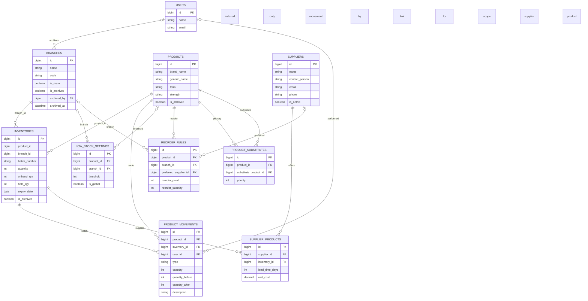
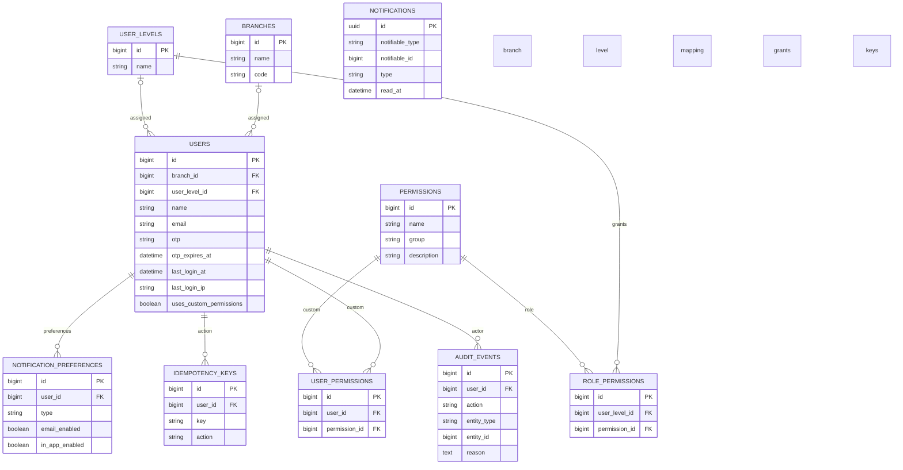
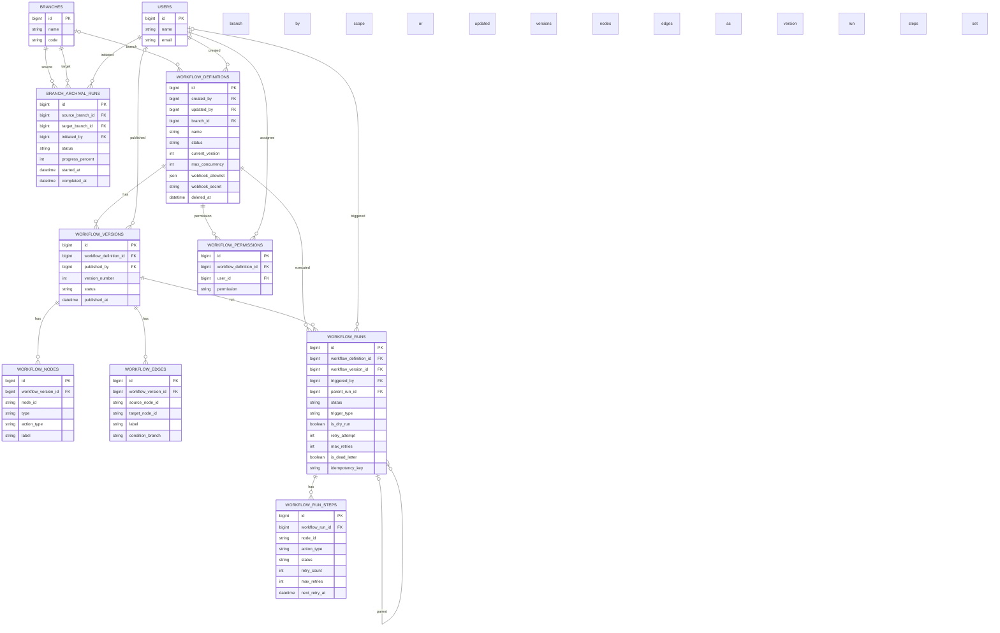
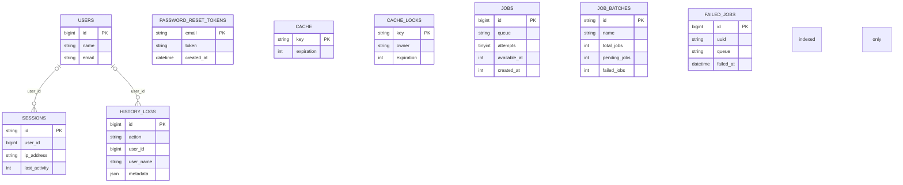

# GTIMS Migration ERD

This document summarizes the database structure defined by the Laravel migrations in `database/migrations`, including later `Schema::table(...)` updates that change the final schema.

Notes:
- This reflects the final intended schema after the alter migrations, not just the original `create_*` files.
- Temporary swap tables used during the supplier migration (`supplier_products_new`, `supplier_products_old`) are intentionally excluded.
- Some relationships are shown as `indexed only` because the migrations use `*_id` columns without creating a database foreign-key constraint.
- `notifications` and `audit_events` include polymorphic-style references that are not normal foreign keys.

## 1. Inventory and Supply

## 2. Dispensing, Orders, Holds, and Requests

```mermaid
erDiagram
    USERS {
        bigint id PK
        string name
        string email
    }

    BRANCHES {
        bigint id PK
        string name
        string code
    }

    BARANGAYS {
        bigint id PK
        string barangay_name
    }

    PRODUCTS {
        bigint id PK
        string brand_name
        string generic_name
    }

    INVENTORIES {
        bigint id PK
        bigint product_id
        bigint branch_id
        string batch_number
    }

    PATIENTRECORDS {
        bigint id PK
        bigint branch_id FK
        bigint barangay_id
        string patient_name
        string purok
        string category
        date date_dispensed
    }

    DISPENSEDMEDICATIONS {
        bigint id PK
        bigint patientrecord_id FK
        bigint barangay_id
        string batch_number
        string generic_name
        string brand_name
        int quantity
    }

    ORDERS {
        bigint id PK
        bigint branch_id FK
        bigint user_id FK
        string status
        datetime admin_approved_at
        datetime finance_approved_at
    }

    ORDER_ITEMS {
        bigint id PK
        bigint order_id FK
        bigint product_id FK
        bigint source_branch_id FK
        bigint source_inventory_id FK
        string source_batch_number
        int quantity_requested
    }

    HOLDS {
        bigint id PK
        bigint branch_id FK
        bigint barangay_id FK
        bigint created_by FK
        bigint approved_by FK
        string type
        string reason_code
        string status
        datetime expires_at
    }

    HOLD_ITEMS {
        bigint id PK
        bigint hold_id FK
        bigint product_id FK
        bigint inventory_id FK
        int quantity
    }

    HOLD_STATUS_HISTORY {
        bigint id PK
        bigint hold_id FK
        bigint changed_by FK
        string old_status
        string new_status
    }

    INCOMING_REQUESTS {
        bigint id PK
        bigint branch_id FK
        bigint requester_id FK
        string department
        string priority
        string status
    }

    REQUEST_ITEMS {
        bigint id PK
        bigint incoming_request_id FK
        bigint product_id FK
        bigint substituted_product_id FK
        int quantity_requested
        int quantity_fulfilled
    }

    REQUEST_COMMENTS {
        bigint id PK
        bigint incoming_request_id FK
        bigint user_id FK
        text comment
    }

    REQUEST_ATTACHMENTS {
        bigint id PK
        bigint incoming_request_id FK
        bigint user_id FK
        string filename
        string original_name
        string mime_type
        bigint size
    }

    REQUEST_STATUS_HISTORY {
        bigint id PK
        bigint incoming_request_id FK
        bigint changed_by FK
        string old_status
        string new_status
    }

    BRANCHES ||--o{ PATIENTRECORDS : recorded at
    BARANGAYS ||--o{ PATIENTRECORDS : barangay_id indexed only
    PATIENTRECORDS ||--o{ DISPENSEDMEDICATIONS : dispenses
    BARANGAYS ||--o{ DISPENSEDMEDICATIONS : barangay_id indexed only
    BRANCHES ||--o{ ORDERS : created for
    USERS ||--o{ ORDERS : created by
    ORDERS ||--o{ ORDER_ITEMS : contains
    PRODUCTS ||--o{ ORDER_ITEMS : requested product
    BRANCHES o|--o{ ORDER_ITEMS : source branch
    INVENTORIES o|--o{ ORDER_ITEMS : source inventory
    BRANCHES ||--o{ HOLDS : branch hold
    BARANGAYS o|--o{ HOLDS : barangay hold
    USERS ||--o{ HOLDS : created or approved by
    HOLDS ||--o{ HOLD_ITEMS : contains
    PRODUCTS ||--o{ HOLD_ITEMS : held product
    INVENTORIES ||--o{ HOLD_ITEMS : held batch
    HOLDS ||--o{ HOLD_STATUS_HISTORY : status changes
    USERS ||--o{ HOLD_STATUS_HISTORY : changed by
    BRANCHES ||--o{ INCOMING_REQUESTS : requested from
    USERS ||--o{ INCOMING_REQUESTS : requester
    INCOMING_REQUESTS ||--o{ REQUEST_ITEMS : contains
    PRODUCTS ||--o{ REQUEST_ITEMS : requested product
    PRODUCTS o|--o{ REQUEST_ITEMS : substituted product
    INCOMING_REQUESTS ||--o{ REQUEST_COMMENTS : has comments
    USERS ||--o{ REQUEST_COMMENTS : wrote
    INCOMING_REQUESTS ||--o{ REQUEST_ATTACHMENTS : has files
    USERS ||--o{ REQUEST_ATTACHMENTS : uploaded by
    INCOMING_REQUESTS ||--o{ REQUEST_STATUS_HISTORY : status changes
    USERS ||--o{ REQUEST_STATUS_HISTORY : changed by
```

## 3. Users, Roles, Permissions, and Notification Context

## 4. Workflow and Branch Lifecycle

## 5. Framework and Support Tables

## Caveats and Assumptions

- `inventories.product_id` and `inventories.branch_id` are important logical relationships, but the migrations only index them and do not declare `constrained(...)`.
- `patientrecords.barangay_id` and `dispensedmedications.barangay_id` are also index-only references in the migrations.
- `sessions.user_id` and `history_logs.user_id` look like user references but are not declared as foreign keys.
- `notifications` uses Laravel's polymorphic `morphs('notifiable')`, so the target entity depends on `notifiable_type`.
- `audit_events.entity_type` plus `entity_id` is a polymorphic audit target, not a fixed FK.
- `workflow_edges.source_node_id` and `workflow_edges.target_node_id` refer to `workflow_nodes.node_id` values inside the same workflow version, but the database does not enforce those references with foreign keys.
